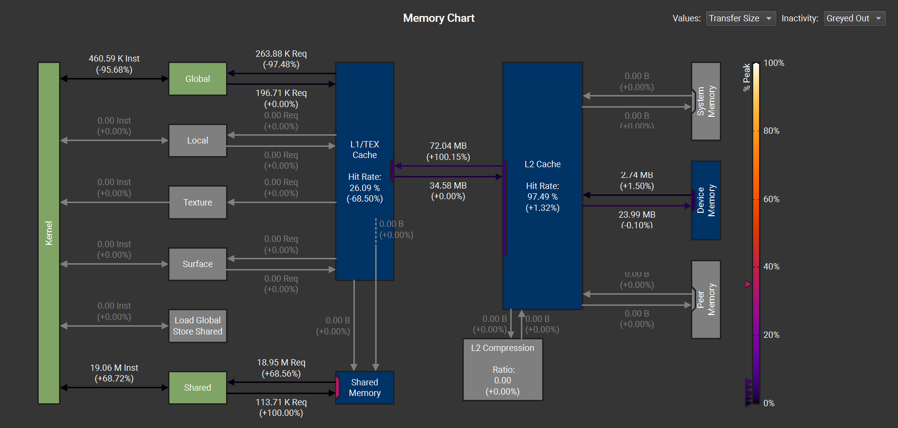
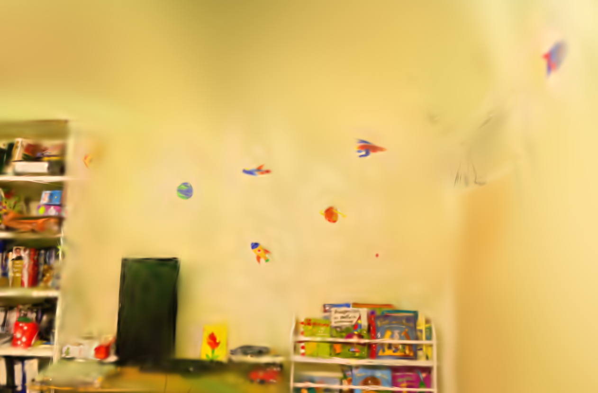
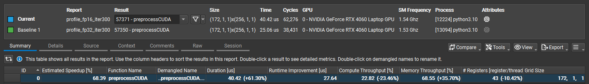
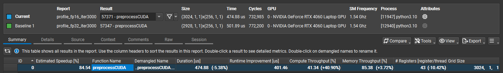

# Accelerating 3D Gaussian Splatting 

This repository contains **research-focused performance optimizations** for the CUDA rasterization backend used in **3D Gaussian Splatting (3DGS)** training.

It is a derivative work of [graphdeco-inria/diff-gaussian-rasterization](https://github.com/graphdeco-inria/diff-gaussian-rasterization), extended to study **memory behavior, kernel efficiency, and training throughput** under visual quality constraints.

---

## Overview
<p align="center">
  
</p>

**Figure 1:** Rendered view produced by the optimized 3D Gaussian Splatting pipeline.

**3D Gaussian Splatting** by Kerbl et al.(2023) enables high quality real-time novel view synthesis, but **training remains performance sensitive** because each iteration executes both:
- a **forward rasterization pass**, and  
- a **backward pass** computing gradients for Gaussian parameters.

This project profiles and accelerates the CUDA rasterization kernels by targeting:
- redundant global memory traffic,
- cache behavior (L1/TEX vs shared memory),
- atomic operation pressure in backward passes,
- bandwidth-dominated workloads.

All optimizations are evaluated under **identical training settings** and validated using **NVIDIA FLIP** to ensure visual correctness.

---

## Optimizations

### 1. Image Chunk Size Allocation Fix
- Corrected buffer allocation by separating:
  - **per-pixel buffers** (`accum_alpha`, `n_contrib`)
  - **per-tile buffers** (`ranges`)
- Reduced temporary image chunk memory:
  - **16.0 MB → 8.4 MB** at the evaluated resolution
- Improves memory correctness *(no runtime behavior change)*

---

### 2. Shared-Memory Caching of Per-Gaussian Features
- Extended the cooperative fetch stage to cache:
  - per-Gaussian **feature vectors**
  - per-Gaussian **depth values**
- Eliminated redundant per-thread global loads inside the innermost compositing loop

<p align="center">
  
</p>

**Figure 2:** Nsight Compute Memory Chart.
The profile shows clear shift from L1/TEX cache traffic to explicit shared-memory reuse.

**Nsight Compute results (single kernel call):**
- −95.7% global memory instructions
- −68.5% L1/TEX activity
- +68.7% shared-memory loads
- Kernel time reduced **2.85 ms → 2.50 ms**
- Compute throughput increased to **>92%**

This shifts reuse from **implicit cache behavior** to **explicit shared-memory reuse**, yielding more predictable access patterns and sligthly higher SM utilization. 
> **Note:**  
> In higher iterations, both memory accesess have similar runtime.
---

### 3. Atomic Operation Reduction (Experimental)
- Targets the **backward rasterization kernel**
- Stages partial results in shared memory to reduce repeated atomic updates
- Achieved **2.88× faster training** *(190 s → 66 s for 3000 iterations)*

<p align="center">
  
  
</p>

**Figure 3:** Rendered images without (left) and with (right) reduced atomic operations.  
While performance improves significantly, visible differences appear due to shared-memory interference.


**Limitation**  
This optimization introduces numerical interference between threads and causes **visible quality degradation**.  
It is **not merged into `main`** and is provided for experimental use only.

---

### 4. Mixed-Precision Spherical Harmonics (FP16)
- Stores SH coefficients in **FP16** to reduce bandwidth and VRAM usage
- Converts to **FP32 in registers** for all arithmetic
- Backward pass accumulates gradients in FP32 before casting to FP16

**Truck scene (SH degree 3):**
- +45.6% training throughput
- −18% peak VRAM usage
- Training time reduced **9:09 → 6:16**

<p align="center">
  <br>
  <em>(a) Iteration 30</em>
</p>

<p align="center">
  <br>
  <em>(b) Iteration 300</em>
</p>

<p align="center">
  <br>
  <em>(c) Iteration 3000</em>
</p>


**Figure 5:**  Nsight Compute analysis across training stages. comparison of kernel performance at iterations 30, 300, and 3000. 

(a) At early stages (Iter 30), overhead leads to lower performance.

(b) Transition phase. 

(c) At late stages (Iter 3000), the reduced
memory traffic of the optimized FP16 kernel results in significant speedup and higher compute throughput

**Trade-off**  
This optimization reduces reconstruction quality (≈2.26 dB PSNR drop).  
It is provided as a **separate branch**.

---

## Validation & Metrics

- **Image Quality:** NVIDIA FLIP  
- **Profiling Tools:**
  - NVIDIA Nsight Systems
  - NVIDIA Nsight Compute
- **Metrics:**
  - iteration time
  - throughput (iterations/s)
  - kernel runtime
  - memory traffic and cache behavior
- **Datasets:**
  - *Playroom* (baseline)
  - *Truck* (high-load evaluation)

---

## Branches

- **`main`**  
  Contains all optimizations that were merged and preserve visual correctness.

- **`reduce_atomic_operations`**  
  Contains the experimental optimization,

- **`ReducedPrecision`**  
  Contains the mixed-precision SH coefficient implementation.

- **`base`**  
  Original upstream code without changes (reference baseline).

---

## Installation / Using This Rasterizer

This repository is intended to be used as a **drop-in replacement** for the original rasterizer submodule in the official 3DGS codebase.

1. Follow the installation instructions for 3DGS:
   - [graphdeco-inria/gaussian-splatting](https://github.com/graphdeco-inria/gaussian-splatting)

2. Clone this repository and **rename it to match the expected submodule name**:

   ```bash
   git clone --recurse-submodules https://github.com/KaanAres10/Accelerating-3DGaussianSplatting.git diff-gaussian-rasterization

   ```

3. Swap the rasterizer submodule with one of our branches:
   - Replace the folder:
     - `gaussian-splatting/submodules/diff-gaussian-rasterization`
   - with the contents of the branch you want to use from this repo.

> **Note:**  
> In addition to the rasterizer submodule, `ReducedPrecision` requires one extra change outside the submodule:  
> `gaussian-splatting/scene/gaussian_model.py`

4. After replacing the submodule, you should need to rebuilt.

---

## Dataset

The datasets used in our experiments:
- **Playroom** (baseline evaluation)
- **Truck** (high-load evaluation)

---

## License

This project contains derivative work of [graphdeco-inria/diff-gaussian-rasterization](https://github.com/graphdeco-inria/diff-gaussian-rasterization).

- The original `LICENSE.md` is included **unchanged**
- **Non-commercial research use only**

---

## Citation

If you use this work in academic research, please cite the original 3DGS paper:

```bibtex
@Article{kerbl3Dgaussians,
  author  = {Kerbl, Bernhard and Kopanas, Georgios and Leimk{\"u}hler, Thomas and Drettakis, George},
  title   = {3D Gaussian Splatting for Real-Time Radiance Field Rendering},
  journal = {ACM Transactions on Graphics},
  volume  = {42},
  number  = {4},
  month   = {July},
  year    = {2023},
  url     = {https://repo-sam.inria.fr/fungraph/3d-gaussian-splatting/}
}
